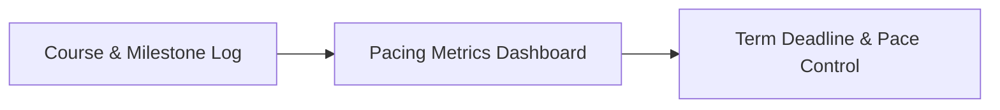
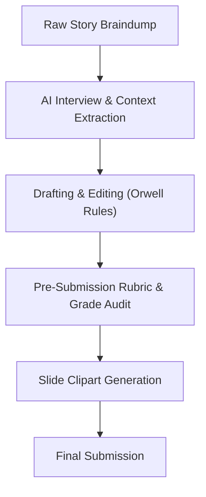

# UMPI YourPace Course Execution Guide
*A Systematic Blueprint for Navigating, Structuring, and Completing Self-Paced Courses in UMPI YourPace*

---

## Overview
This guide outlines a proven, end-to-end framework for planning, researching, writing, and submitting coursework in the **UMPI YourPace** Competency-Based Education program. It is designed to maximize efficiency, maintain high academic rigor, leverage real-world experience, and streamline progression from Milestone 1 to the Final Assessment.

---

## About the Author

Hi! My name is **Christopher Thompson** (known on Discord and Reddit as **`Bigcjat`**).

### My Journey Through UMPI YourPace
I initially set out to earn a Bachelor of Liberal Studies (BLS) through UMPI YourPace simply to satisfy a visa requirement. Shortly after starting, a classmate challenged me to tackle the full **Bachelor of Business Administration (BBA)** instead. At first, I obsessed over the idea that it was impossible—it required 19 university courses instead of 10. 

However, as I built and refined the systematic execution method detailed in this guide, I found that not only was it possible, but I finished the entire BBA with time left over in the term and several multi-day breaks along the way. 

I am currently pursuing my **Master of Arts in Organizational Leadership (MAOL)** through UMPI YourPace at a much more relaxed, comfortable pace because I simply execute the exact execution system outlined here. Following the MAOL, my plan is to continue into the **MS in Business Intelligence**.

### Professional & Background Context
* **Oil & Gas Operations**: 20 years in the oil and gas industry, including 11 years as an operational field foreman for a producer on the British Columbia / Northwest Territories border in Canada.
* **Software Engineering & Tech**: Developer in JavaScript, Python, and PHP for ~25 years. I first went to college in 2001 for a Network Diploma specializing in Windows 2000 and worked briefly at Yahoo!.
* **Location & Lifestyle**: I currently live in Asia, traveling between Tokyo, Singapore, Hanoi, Taiwan, and next South Korea. I have visited Japan 13 times so far and plan to settle there permanently in the future.

---

## Part 1: Degree Planning & Transfer Credit Optimization

Before starting your UMPI YourPace term, maximize your transfer credits to minimize cost and time spent in residency. 

### Leveraging Free Resources: Plotted Path
* **Free Degree Planning Resource**: Visit **[plottedpath.com/free](https://www.plottedpath.com/free)** for comprehensive, up-to-date transfer equivalency charts and General Education (GEC) mapping sheets specifically for UMPI YourPace.
* **Transfer Provider Mapping**: Plotted Path maintains exact equivalency breakdowns showing which courses transfer into UMPI YourPace degree programs from third-party platforms (**Sophia, Study.com, StraighterLine, Coursera**) versus which courses are **UMPI Only**.
* **Community Guidance**: The creator of Plotted Path (`whimsicalone` / Plotted Path ✨) is active in the UMPI YourPace student Discord community, regularly answering student questions on course planning and minor combinations.
* **Custom Degree Plans**: For students with complex prior credits or specific timeline targets, Plotted Path offers personalized, custom degree mapping services for a fee—well worth the investment to optimize your transfer strategy before enrolling.

---

## Part 2: Proactive Instructor Selection & Community Research

One of the single most effective strategies in UMPI YourPace is spending **10 minutes researching and requesting specific instructors** before adding a course. 

While core assignment prompts and rubrics remain identical regardless of who teaches the class, instructor grading turnaround speed, feedback depth, and evaluation style vary significantly. Selecting an instructor who aligns with your pace and communication style can save days of waiting time per course.

### 1. Leverage Community Reviews (Discord Channels)
Before requesting a new course section, check the UMPI YourPace student community channels:
* **`#professor-reviews`**: Read feedback on grading turnaround times (e.g., 24-hour graders vs. multi-day turnaround), accommodating communication, and grading fairness.
* **`#class-reviews`**: Review overall course difficulty, number of milestone activities, and specific instructor recommendations for that exact class.

### 2. How to Lookup Available Instructors (MaineStreet Class Search)
Follow these exact steps to see which professors are teaching upcoming UMPI YourPace course sections:

1. Log into **`mycampus.maine.edu`**.
2. Under **Category Links**, click **Mainestreet** $\rightarrow$ **Classic Student Center**.
3. Click the **House icon** at the top right (next to the bell icon).
4. In the top search bar, type **`class search`** (*do NOT press enter*).
5. Click **"Class Search Curriculum Management"** from the pop-up results.
6. Set **Institution** to *University Maine Presque Isle*.
7. Set **Term** to your active term (e.g., *2026 Summer* or *2026 Fall*).
8. Set **Session** to *OnlineMaine Session 01* (YourPace Session 1) or *OnlineMaine Session 02* (YourPace Session 2).
9. Click **Search**. Scroll through the alphabetized course list to inspect active sections and view the assigned instructor for each section.

### 3. Requesting Your Preferred Instructor
* **Email Your Request**: When emailing advising (`yourpace@maine.edu`) to add your next competency, explicitly request your preferred professor by name.
* **Why it matters**: Content is standardized across all sections, but securing an instructor who grades efficiently keeps your momentum going without administrative bottlenecks.

---

## Part 3: Macro Level — UMPI YourPace Pacing & Progress Tracker (Spreadsheet System)

While local folders handle individual course files, a **Macro Pacing Spreadsheet** gives you total visibility over your entire UMPI YourPace degree plan, term deadlines, and milestone progress.

Instead of guessing where you stand in a course or term, maintain a centralized master spreadsheet. Below are the **essential minimum tracking fields** every UMPI YourPace student should maintain, along with the specific rationale for *why* each is critical.



### Essential Minimum Fields to Track & Rationale

#### 1. Course Identifiers (Course Code, Name, & Platform)
* **What to Track**: Course Code (e.g., `BUS 353`), Course Title, Credit Hours, and Platform (YourPace, Sophia, Study.com).
* **Why**: Self-paced degrees involve multiple overlapping course codes across major, minor, and general education requirements. Clear identification prevents confusion between similar courses (e.g., `BUS 240` vs. `BUS 245` vs. `BUS 415`) and tracks transfer credit sources.

#### 2. Granular Status & Color Coding
* **What to Track**: Current status for every course (*Started, Draft Sent, Final Sent, Complete, Transferred, Planned*).
* **Why**: UMPI YourPace allows you to have multiple active courses or submissions pending simultaneously. Color-coded status fields give an instant, high-level visual check of what is currently on your plate versus what is waiting on instructor review.

#### 3. Individual Milestone Progress Columns (M1 through M5 & Final)
* **What to Track**: Separate columns for every milestone in the course (**M1, M2, M3, M4, M5, Final Draft, Final Assessment**) recording exact score values (e.g., `4/4`, `3.5/4`, `Submitted`).
* **Why**: In traditional courses, a class is just "in progress." In UMPI YourPace, a course is an assembly line of 4–6 discrete deliverables. Tracking every milestone tells you the exact bottleneck in any course so you know whether you are waiting on Milestone 2 or ready to write the Final Assessment.

#### 4. Submission Timers (Date/Time Submitted & Elapsed Time)
* **What to Track**: Exact timestamp of when an assignment was submitted (e.g., `Aug 1, 15:08`) and a calculated timer (*Time Since Submission*).
* **Why**: Instructors have varying turnaround times (typically 24 to 72 hours). Tracking elapsed time tells you exactly when to expect feedback and alerts you when a submission has exceeded standard grading windows so you know when to follow up.

#### 5. Term Clock Metrics (Elapsed Days vs. Days Remaining)
* **What to Track**: Total days passed in the current term vs. days remaining until the term ends.
* **Why**: Freedom in self-paced programs can lead to pacing traps. Seeing **"27 Days Remaining"** alongside **"4 Courses Left"** instantly establishes your required completion pace (e.g., 6.7 days per course) to keep you on schedule.

#### 6. Hard Administrative Cutoff Deadlines
* **What to Track**: UMPI YourPace administrative deadlines (Course Add Cutoff, Milestone Submission Cutoff, Final Draft Cutoff, Final Grade Cutoff).
* **Why**: UMPI YourPace has strict cutoff rules for adding new courses or submitting final papers before the 8-week term closes. Missing a cutoff can prevent you from unlocking your next course.

#### 7. Instructor Velocity & Strategy Notes
* **What to Track**: Instructor grading speed (e.g., *"Grades in 24 hours"* vs. *"Takes 3 days"*), specific feedback patterns, or cross-credited course notes.
* **Why**: Knowing instructor turnaround speed lets you strategically sequence submissions—submitting to a fast grader right before a weekend ensures you get your next milestone unlocked quickly without downtime.

---

## Part 4: Micro Level — Course Workspace Architecture & Organization

Traditional self-paced platforms (like Sophia or Study.com) often encourage chaotic file habits—saving random drafts and downloads directly to the Desktop or Downloads folder. In UMPI YourPace courses, disorganized workspaces lead to lost prompt requirements, misplaced citations, and duplicated effort.

By adopting a **Clean Module Directory Architecture**, you keep your thoughts organized, reduce cognitive friction, and eliminate wasted time.

### Standardized Course Directory Structure
For every course, create a dedicated folder structured as follows:

```text
/Course_Name (e.g., OLS 500 Data Driven)
├── sources.txt                 <-- Central master stash of all citations, URLs, & video .srt scripts
├── mod 1/                      <-- Milestone 1 folder
│   ├── mod1.txt                <-- Local plain-text copy of assignment prompt & rubric
│   ├── Milestone_1.txt         <-- Working draft file for Milestone 1
│   └── Milestone_1.docx        <-- Final formatted submission file
├── mod 2/                      <-- Milestone 2 folder
│   ├── mod2.txt                <-- Local plain-text copy of assignment prompt & rubric
│   ├── Milestone_2.txt         <-- Working draft file for Milestone 2
│   └── Milestone_2.docx        <-- Final formatted submission file
├── mod 3/                      <-- Milestone 3 folder
│   ├── mod3.txt                <-- Local plain-text copy of assignment prompt & rubric
│   ├── Milestone_3.txt         <-- Working draft file for Milestone 3
│   └── Milestone_3.docx        <-- Final formatted submission file
└── final/                      <-- Final Assessment folder
    ├── Final_Submission.txt    <-- Working draft file for Final Assessment
    └── Final_Submission.docx   <-- Final formatted submission file
```

### The "Prompt Inoculation" Method (`modX.txt`)
Before typing a single word of a draft, copy the exact assignment prompt and rubric criteria from your Brightspace/D2L portal directly into a local plain-text file (`mod1.txt`, `mod2.txt`).

* **Why it matters**: You never have to switch tabs, log back into the LMS, or hunt for rubric guidelines while writing. Your prompt criteria sit right next to your draft.

### Plain-Text First Drafting (`.txt` to `.docx`)
Write all working drafts in simple plain-text (`.txt`) before exporting to Microsoft Word (`.docx`) for final submission.
* **Why it matters**: Drafting in plain text forces you to focus 100% on logical arguments, thesis development, and source citations without getting distracted by Word line spacing, font dropdowns, or tab stops until final formatting.

---

## Part 5: The Core Human Execution System (Non-AI Workflow)

### Step 1: Syllabus & Instructor Contact Setup
Before writing a single sentence, open the **Syllabus / Welcome tab** in your Brightspace portal and read it from top to bottom.

* **Locate Instructor Contact Information Immediately**: Students frequently struggle to find how to contact their professor. The Syllabus tab is the central hub containing your instructor's **direct email address** and often an **urgent phone/text number** (e.g., *"Feel free to text 207-XXX-XXXX"*). Copy this contact info into your `sources.txt` or `mod1.txt` file on Day 1.
* **Map the Course Arc**: Identify every milestone assignment, knowledge check, and the final project/essay requirement upfront.
* **Select an Overarching Topic Early**: Pick a single, robust research topic or real-world operational scenario during Module 1 that can thread directly through every milestone into the final project.
* **Cumulative Stacking (Building the Final as You Go)**: Re-using a consistent operational theme means Milestones 1–5 serve as building blocks. By the time you reach the Final Assessment, 70% of your research, references, and core arguments are already written.

---

### Step 2: Source Extraction & Video Subtitles
Maximize learning and eliminate note-taking during lectures.

* **Watch Assigned Videos for Deep Context**: Video lectures and talks provide far richer context and better conceptual understanding than dry textbook readings alone. Watch them to absorb the core ideas.
* **Download Video Subtitles (`.srt`)**: Use free transcript tools (e.g., DownSub) to download the `.srt` subtitle files for every course video.
* **Zero Note-Taking While Watching**: Do not pause videos to write manual notes. Sit back and focus entirely on watching and understanding the material. The `.srt` files serve as your complete, word-for-word transcript, allowing you to search for exact quotes, timestamps, and key terms later when drafting your assignments.
* **Centralize Course Sources**: Copy all required readings, legal statutes, textbook chapters, and video `.srt` transcripts into your `sources.txt` file for quick reference.

---

### Step 3: The Lived-Experience Braindump
Academic essays backed only by textbook summaries sound generic. Ground your work in real experience.

* **Write a Raw Operational Story**: Spend 10–15 minutes braindumping a real workplace scenario, project, or operational problem you have managed.
* **Focus on Concrete Details**: Include specific tools, safety rules, regulatory mandates, budget approvals, or operational constraints.
* **No Formatting Required**: Do not worry about grammar or academic structure during the braindump—focus strictly on capturing authentic operational facts.

---

### Step 4: Source Selection & Mapping
Connect your raw operational story to academic frameworks.

* **Filter Your `sources.txt`**: Select exact Primary, Secondary, and Tertiary sources from your central list to support your topic:
  * **Primary**: Government regulations, legal statutes, original data sets, or direct policy manuals.
  * **Secondary**: Peer-reviewed journal articles and empirical meta-analyses.
  * **Tertiary**: Textbooks, research methodology manuals, and standards checklists.
* **Map Sources to Rubric Questions**: Ensure each chosen source answers a specific prompt or research question required by the assignment rubric.

---

### Step 5: Plain English Writing & Orwell’s 6 Rules
Avoid pompous academic jargon and artificial filler. Apply George Orwell's classic plain-English rules (*"Politics and the English Language"*):

1. **Never use a metaphor, simile, or figure of speech** you are used to seeing in print.
2. **Never use a long word** where a short one will do.
3. **If it is possible to cut a word out**, always cut it out.
4. **Never use the passive voice** where you can use the active voice (*"We managed the site"* vs *"The site was managed by us"*).
5. **Never use a foreign phrase, scientific term, or jargon word** if you can think of an everyday English equivalent.
6. **Break any of these rules** sooner than say anything outright barbarous.

---

## Part 6: Responsible & Authorized AI Integration

If your institution and course policy explicitly permit AI assistance, use AI strictly as a force multiplier for preparation, feedback, and visual assets—not as a substitute for authentic human experience.



### 1. Interactive Context Interviews (Refining Your Braindump)
Instead of asking AI to write for you, use AI as an interviewer to extract missing operational context.

* **The Prompt**: Feed your raw story braindump to the AI alongside the course rubric.
* **The Directive**: Instruct the AI to act as a senior project manager or academic interviewer and ask you 3–5 targeted questions about missing metrics, policy details, or operational steps needed to align your story with the rubric criteria.
* **Outcome**: You provide the authentic answers, creating a rich, fully contextualized foundation for your assignment.

---

### 2. Automated Rubric & Professor Grading Simulation
Get an objective pre-submission audit before handing in your work.

* **The Inputs**:
  1. The full assignment prompt and rubric criteria (`modX.txt`).
  2. Past feedback your professor has given on previous assignments.
  3. Student review insights or known professor grading preferences.
  4. Your completed draft (`Milestone_X.txt`).
* **The Directive**: Ask the AI to grade your draft strictly against the rubric, highlight any missing criteria or formatting errors, and estimate your score category (*Exemplary, Proficient, Developing*).

---

### 3. Presentation Asset Generation (Minimalist Slide Clipart)
When creating presentation slides for milestone assignments, generate custom visual assets that maintain clean, professional focus.

* **Visual Style**: Classic 90s-style minimalist clipart (MS Office 97/2000 aesthetic).
* **Composition Rules**:
  * Focus on **one single clear subject or scene** (e.g., 1–2 people working or 1 key object).
  * **Zero floating extra icons**, zero background clutter, zero random lightbulbs/gears.
  * **No text, words, lettering, or numbers** embedded in the image.
* **Integration**: Insert the clean clipart into your PowerPoint/Keynote slides and embed your presentation script word-for-word into the **Speaker Notes** section of each slide.

---

## Part 7: Student Mindset, Motivation & Burnout Strategies

Self-paced UMPI YourPace programs offer unmatched flexibility, but they demand internal discipline. Maintaining the right psychological perspective and humor is essential to keeping your momentum high.

### 1. The 10-Minute Burnout Prevention Rule
On low-motivation days when you are feeling burned out, finding excuses, or seeking every distraction:
* **The Rule**: Force yourself to spend **just 10 minutes** on every active course you have open.
* **Why it works**: You don't need to finish an entire essay or milestone. Spending 10 minutes reading a prompt, organizing references, or writing one paragraph keeps your brain locked in **"student mode."** It keeps the material fresh, ensures daily forward progress, and almost always breaks through the friction of starting.

### 2. Perspective & Confidence
* **Demystify Higher Education**: Never let academic anxiety or intimidation stop you. College was fundamentally designed for drunk, high, horny, dumb teenagers figuring out life for the first time.
* **The Bottom Line**: If thousands of teenagers can stumble their way through college and earn a degree, a mature adult bringing real-world operational experience, discipline, and practical problem-solving skills can easily earn ten.
